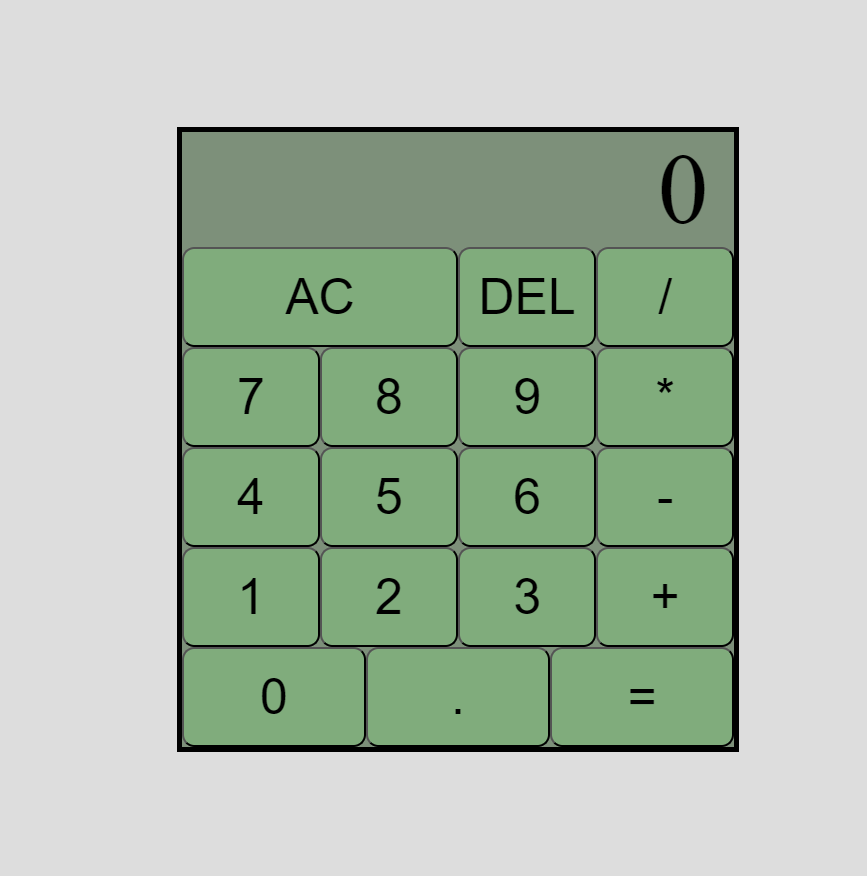

# Calculator with Keyboard Support

This is my fifth project in [The Odin Project](https://www.theodinproject.com/) web development course, a simple calculator with keyboard and mouse support. The calculator allows users to perform basic arithmetic operations (addition, subtraction, multiplication, and division) and includes essential features like clearing the display and deleting inputs.

## Features

- **Keyboard Support**:  
  - Enter numbers and operators directly using your keyboard.
  - Press **Enter** to calculate the result.
  - Press **Backspace** to delete the last input.
  - Press **Escape** to clear the entire display.

- **Mouse Support**:  
  - Click on numbers and operators to build your calculations.

- **Additional Details**:  
  - Supports floating-point numbers, which are rounded to **2 decimal places**.
  - Allows clearing the calculator and deleting characters for better user control.

## Limitations & Future Improvements

This project is a stepping stone in my web development journey. While functional, it has room for improvement:

- **Styling**:  
  - Enhance the design for a more polished look.
  - Improve the display to accommodate larger numbers more gracefully.

- **Functionality**:  
  - Add support for advanced operations like percentages, square roots, or exponents.
  - Allow negative numbers in calculations.
  - Improve handling of edge cases.

## Screenshots

## Technologies Used

- **HTML**: Used to structure the calculator and its elements.
- **CSS**: Applied for basic styling, including layout and appearance.
- **JavaScript**: Handles the calculator's core logic and user interaction, including keyboard and mouse event handling.

## Acknowledgements

This project is part of the curriculum in [The Odin Project](https://www.theodinproject.com/). It represents a step forward in my journey toward becoming a web developer. I'm looking forward to refining and expanding on this project as I continue learning.

---

Thank you for taking the time to explore my calculator project! 🚀
Dont forget to divide by zero <3